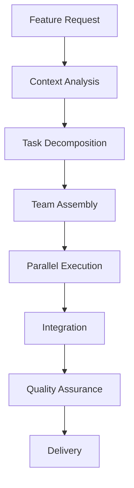

# Intelligent Orchestration System

## 🧠 Beyond Simple Context Detection

Our orchestration system doesn't just detect what framework you're using - it understands your entire project context and assembles the perfect team for any task.

## 🎯 The Intelligence Layer

### Understanding Vague Requirements

When you say **"Build user management"**, the Tech Lead understands:

```yaml
Implicit Requirements Detected:
- User registration and login
- Password reset functionality  
- Profile management
- Role-based permissions
- Session handling
- Security best practices
- API endpoints
- Frontend forms
- Database schema
- Email notifications
```

### Intelligent Task Breakdown

The orchestrator transforms high-level requests into actionable plans:

```
Input: "I need a blog"

Tech Lead Analysis:
├── Content Management
│   ├── Post CRUD operations
│   ├── Category management
│   └── Tag system
├── User Features  
│   ├── Author profiles
│   ├── Comments system
│   └── Social sharing
├── Technical Requirements
│   ├── SEO optimization
│   ├── RSS feed
│   └── Search functionality
└── Performance
    ├── Caching strategy
    └── Image optimization
```

## 🔄 Orchestration Patterns

### 1. Feature Orchestration

For complete features spanning multiple layers:



### 2. Problem-Solving Orchestration

For debugging and optimization:

```yaml
Pattern: Diagnostic First
1. Analyze symptoms
2. Profile application
3. Identify root causes
4. Assemble specialists
5. Implement fixes
6. Verify resolution
```

### 3. Migration Orchestration

For technology transitions:

```yaml
Pattern: Gradual Migration
1. Assess current state
2. Plan migration path
3. Create compatibility layer
4. Migrate incrementally
5. Verify each step
6. Clean up legacy code
```

## 🎪 The Orchestrator's Toolkit

### Context Understanding

The orchestrator maintains rich context:

```json
{
  "project": {
    "type": "e-commerce",
    "stage": "growth",
    "stack": {
      "backend": "laravel",
      "frontend": "react",
      "database": "mysql",
      "cache": "redis"
    }
  },
  "patterns": {
    "architecture": "service-oriented",
    "testing": "tdd",
    "deployment": "containerized"
  },
  "history": {
    "recent_tasks": ["api_creation", "auth_setup"],
    "known_issues": ["n+1_queries", "slow_dashboard"]
  }
}
```

### Decision Making

How the orchestrator chooses agents:

```javascript
function orchestrate(request, context) {
  // Understand intent
  const intent = analyzeIntent(request);
  
  // Consider context
  const projectType = context.project.type;
  const techStack = context.stack;
  
  // Make intelligent decisions
  if (intent.includes('payment') && projectType === 'e-commerce') {
    return assembleTeam([
      'payment-specialist',
      'security-guardian',
      'laravel-backend-expert',
      'frontend-developer'
    ]);
  }
  
  // Always have a plan
  return defaultTeamForIntent(intent);
}
```

## 🚀 Advanced Orchestration Features

### 1. Predictive Assembly

The system anticipates needs:

```yaml
User: "Add search to my app"

Orchestrator Predicts:
- You'll need search UI components
- Backend will require indexing
- Database needs optimization
- Caching strategy required
- Auto-complete functionality expected

Assembles: Search specialist, Frontend dev, 
          Database expert, Performance optimizer
```

### 2. Adaptive Orchestration

Adjusts strategy based on project maturity:

```yaml
New Project:
- Focus on rapid prototyping
- Use flexible patterns
- Prioritize functionality

Mature Project:
- Maintain existing patterns
- Ensure backward compatibility
- Optimize for scale
```

### 3. Cross-Functional Coordination

Handles complex requirements:

```yaml
Request: "Make my app GDPR compliant"

Coordinates:
- Legal compliance expert
- Database architect (data management)
- Backend developer (consent APIs)
- Frontend developer (consent UI)
- Security guardian (data protection)
```

## 🎭 Real-World Orchestration Examples

### Startup MVP
```
"I have an idea for a task management app"

Orchestration:
→ Rapid prototyping mode
→ Focus on core features
→ Simple architecture
→ Quick deployment setup
```

### Enterprise Integration
```
"Integrate with our existing SAP system"

Orchestration:
→ Integration specialist
→ Security review
→ Data mapping expert
→ Testing coordinator
```

### Performance Crisis
```
"Our Black Friday sale crashed the site"

Orchestration:
→ Emergency response mode
→ Performance expert leads
→ Database optimizer
→ Infrastructure scaler
→ Cache strategist
```

## 📊 Orchestration Metrics

The system optimizes for:

1. **Completeness**: All aspects addressed
2. **Efficiency**: Minimal redundancy
3. **Quality**: Best practices enforced
4. **Speed**: Parallel execution
5. **Coherence**: Consistent implementation

## 🔮 Future of Orchestration

### Learning System

The orchestrator improves over time:
- Learns from successful patterns
- Adapts to team preferences
- Optimizes agent selection
- Predicts common needs

### Domain Intelligence

Specialized orchestration for:
- E-commerce patterns
- SaaS architectures  
- Mobile app development
- Enterprise systems
- Startup MVPs

## 🌟 The Result

An intelligent system that:
- **Understands** beyond keywords
- **Plans** like a senior architect
- **Assembles** the perfect team
- **Coordinates** seamlessly
- **Delivers** complete solutions

No configuration. No complexity. Just intelligence.