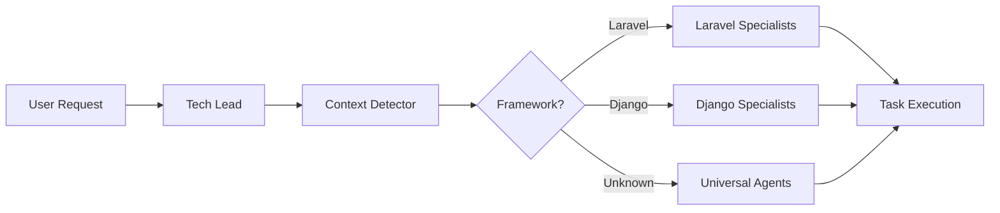

# Awesome Claude Agents 🚀

**Context-aware AI agents that automatically detect your technology stack** and provide specialized expertise. Get framework-specific best practices without configuration.

## 🧠 Intelligent Context Detection

The system **automatically detects** what you're working with:
- 🔍 Analyzes your project structure
- 🎯 Identifies frameworks and languages
- 🚀 Routes to specialized experts
- 🔄 Falls back to universal agents when needed

### How It Works

```bash
# In a Laravel project
User: "Build an API"
System: Detects Laravel → Uses laravel-api-architect

# In a Django project  
User: "Build an API"
System: Detects Django → Uses django-api-developer

# In an unknown project
User: "Build an API"
System: No framework → Uses universal api-architect
```

## 📁 Agent Organization

```
agents/
├── orchestrators/          # Project coordinators
│   ├── tech-lead-orchestrator.md
│   └── context-detector.md
│
├── core/                   # Always available
│   ├── code-archaeologist.md
│   ├── code-reviewer.md
│   ├── performance-optimizer.md
│   └── security-guardian.md
│
├── universal/              # Framework-agnostic
│   ├── api-architect.md
│   ├── backend-developer.md
│   ├── frontend-developer.md
│   └── tailwind-css-expert.md
│
└── specialized/            # Deep expertise
    ├── laravel/
    │   ├── laravel-api-architect.md
    │   ├── laravel-backend-expert.md
    │   └── laravel-eloquent-expert.md
    ├── react/
    ├── django/
    └── rails/
```

## 🎭 Available Agents

### 🎯 Orchestrators
**Intelligent project coordination**

- **[Tech Lead Orchestrator](agents/orchestrators/tech-lead-orchestrator.md)** - Context-aware project coordinator
- **[Context Detector](agents/orchestrators/context-detector.md)** - Automatic technology detection

### 💎 Core Agents
**Cross-cutting expertise for any project**

- **[Code Archaeologist](agents/core/code-archaeologist.md)** - Explores and documents any codebase
- **[Code Reviewer](agents/core/code-reviewer.md)** - Universal code quality standards
- **[Performance Optimizer](agents/core/performance-optimizer.md)** - Makes any system faster
- **Security Guardian** *(coming soon)* - Security for all stacks

### 🌐 Universal Agents
**Framework-agnostic implementations**

- **[API Architect](agents/universal/api-architect.md)** - RESTful and GraphQL design
- **[Backend Developer](agents/universal/backend-developer.md)** - Multi-language backend expertise
- **[Frontend Developer](agents/universal/frontend-developer.md)** - Modern UI development
- **[Tailwind CSS Expert](agents/universal/tailwind-css-expert.md)** - Utility-first CSS mastery

### 🚀 Specialized Agents
**Deep framework expertise**

#### Laravel Specialists
- **[Laravel API Architect](agents/specialized/laravel/laravel-api-architect.md)** - Laravel-specific API patterns
- **[Laravel Backend Expert](agents/specialized/laravel/laravel-backend-expert.md)** - Full Laravel development
- **[Laravel Eloquent Expert](agents/specialized/laravel/laravel-eloquent-expert.md)** - Database and ORM mastery

#### More Specialists Coming Soon
- React specialists
- Django experts
- Rails developers
- Vue.js architects

## 🔥 Key Features

### 🤖 Automatic Framework Detection
```yaml
Project Indicators:
- composer.json → Laravel/PHP
- package.json → JavaScript/Node.js
- requirements.txt → Python/Django
- Gemfile → Ruby/Rails
```

### 🎯 Intelligent Routing
The Tech Lead Orchestrator:
1. Detects your project type
2. Routes to appropriate specialists
3. Falls back to universal agents
4. Maintains context throughout

### 🔗 Agent Collaboration
Agents work together seamlessly:
```
User Request → Context Detection → Specialist Selection → Task Execution → Review
```

## 🚀 Quick Start

```bash
# Clone the repository
git clone https://github.com/bootstrapguru/awesome-claude-agents.git

# Install agents
cp -r awesome-claude-agents/agents/* ~/.claude/agents/

# Start building!
claude "Build a product API"
```

## 💡 Usage Examples

### Example 1: Laravel Project
```bash
# You're in a Laravel project
> Build user authentication

# System automatically:
1. Detects Laravel via composer.json
2. Routes to laravel-backend-expert
3. Implements Laravel Sanctum
4. Follows Laravel conventions
```

### Example 2: Unknown Stack
```bash
# You're in a new project
> Build user authentication

# System automatically:
1. No framework detected
2. Routes to universal/backend-developer
3. Implements framework-agnostic auth
4. Uses JWT standards
```

### Example 3: Mixed Stack
```bash
# Laravel backend + React frontend
> Build a dashboard

# System automatically:
1. Detects both technologies
2. Uses laravel-api-architect for API
3. Uses react-specialist for UI
4. Coordinates integration
```

## 🏗️ Architecture

### Context Detection Flow


### Agent Selection Logic
```javascript
if (context.backend === "laravel" && task.type === "api") {
  use("laravel-api-architect");
} else if (context.backend === "django" && task.type === "api") {
  use("django-api-developer");
} else {
  use("universal/api-architect");
}
```

## 🤝 Contributing

We welcome contributions! Add new specialists or improve existing agents:

1. Fork the repository
2. Create your agent following our patterns
3. Ensure it works with context detection
4. Submit a pull request

See [CONTRIBUTING.md](CONTRIBUTING.md) for detailed guidelines.

## 📚 Documentation

- [Creating Agents](docs/creating-agents.md) - Build new specialists
- [Interconnected Agents](docs/interconnected-agents.md) - Agent collaboration
- [Best Practices](docs/best-practices.md) - Agent development tips
- [Quick Start Guide](docs/quick-start.md) - Get running in 5 minutes

## 🎯 Philosophy

1. **Context First** - Understand the project before acting
2. **Specialized Expertise** - Deep knowledge when available
3. **Universal Fallback** - Always have a solution
4. **Seamless Collaboration** - Agents work as a team

## 🚀 Benefits

- **Zero Configuration** - Just describe what you want
- **Framework Best Practices** - Automatically applied
- **Consistent Quality** - Across any technology
- **Faster Development** - Right expertise instantly
- **Learning Tool** - See how experts approach problems

## 🗺️ Roadmap

### Currently Available
- ✅ Context detection system
- ✅ Laravel specialists
- ✅ Universal agents
- ✅ Core utilities

### Coming Soon
- [ ] React specialists
- [ ] Django experts
- [ ] Vue.js architects
- [ ] Rails developers
- [ ] More frameworks

## 📊 Community

- ⭐ Star this repo to show support
- 🐛 [Report issues](https://github.com/bootstrapguru/awesome-claude-agents/issues)
- 💬 [Join discussions](https://github.com/bootstrapguru/awesome-claude-agents/discussions)
- 🏆 [See who's using it](USERS.md)

## 📄 License

MIT License - Use freely in your projects!

---

<p align="center">
  <strong>Experience intelligent, context-aware development assistance!</strong><br>
  The right expert for your stack, automatically.
</p>

<p align="center">
  <a href="https://github.com/bootstrapguru/awesome-claude-agents">GitHub</a> •
  <a href="docs/quick-start.md">Quick Start</a> •
  <a href="https://discord.gg/awesome-claude-agents">Discord</a>
</p>