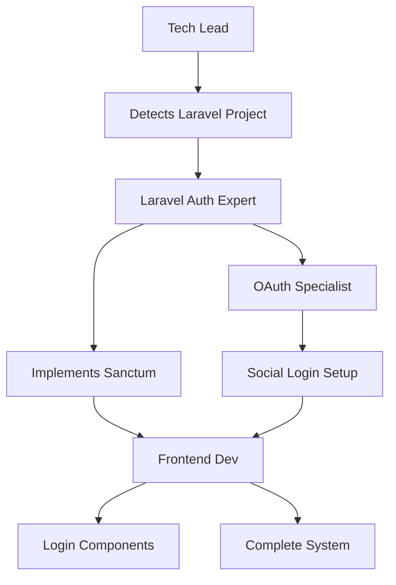

# How Agent Teams Collaborate

Learn how AI agents work together like a real development team to build complete features.

## 🎯 The Team Approach

Our agents don't work in isolation - they collaborate like a well-coordinated development team. Each agent has specialized skills and knows when to involve others.

## 👥 Team Dynamics

### The Tech Lead Role

The Tech Lead Orchestrator acts as your project manager:

```
User Request
    ↓
Tech Lead analyzes
    ↓
Creates execution plan
    ↓
Assembles right team
    ↓
Coordinates execution
    ↓
Delivers complete solution
```

### Specialist Collaboration

Agents hand off work seamlessly:

```yaml
Laravel Expert: "I've created the API endpoints"
    → Passes to Frontend Dev: "Here are the endpoints to integrate"
    
Frontend Dev: "Building UI components"
    → Asks API Architect: "Need pagination structure"
    
API Architect: "Here's the standard pattern"
    → Updates Laravel Expert: "Please implement this structure"
```

## 🎭 Real Collaboration Examples

### Example 1: E-commerce Feature

**User**: "Add a shopping cart to my application"

**Tech Lead's Plan**:
```
1. Database Expert - Design cart schema
2. Backend Expert - Implement cart logic
3. API Architect - Create endpoints
4. Frontend Dev - Build UI components
5. Performance Expert - Optimize queries
```

**Execution Flow**:
```
Database Expert:
  ✓ Creates tables: carts, cart_items
  ✓ Sets up relationships
  → Hands off to Backend Expert

Backend Expert:
  ✓ Implements Cart model with methods
  ✓ Creates CartService for business logic
  → Requests API design from API Architect

API Architect:
  ✓ Designs RESTful endpoints
  ✓ Defines request/response formats
  → Coordinates with Backend & Frontend

Frontend Developer:
  ✓ Creates cart components
  ✓ Implements state management
  → Asks for optimization

Performance Expert:
  ✓ Adds eager loading
  ✓ Implements caching
  ✓ Creates database indexes
```

### Example 2: Authentication System

**User**: "I need user authentication with social login"

**Team Coordination**:



## 🔄 Communication Patterns

### 1. Sequential Handoff
```
Agent A completes task → Agent B continues with output → Agent C finalizes
```

Example: Database design → Backend implementation → API creation

### 2. Parallel Execution
```
         ┌→ Agent B (Backend)
Agent A →┤
         └→ Agent C (Frontend)
```

Example: API and UI developed simultaneously

### 3. Consultation Pattern
```
Agent A working → needs expertise → consults Agent B → continues work
```

Example: Frontend dev needs API structure guidance

### 4. Review Pattern
```
Agent A implements → Agent B reviews → Agent A refines → merge
```

Example: Code implementation followed by security review

## 📋 Task Decomposition

### How Tech Lead Breaks Down Tasks

**Vague Request**: "Make my app faster"

**Decomposed Tasks**:
1. Performance Expert: Profile application
2. Database Expert: Analyze queries
3. Frontend Dev: Check rendering issues
4. Backend Expert: Review algorithms
5. DevOps Expert: Check infrastructure

### Smart Task Ordering

The Tech Lead orders tasks intelligently:

```yaml
Priority Order:
1. Dependencies first (database schema)
2. Core logic next (business rules)
3. Interfaces after (APIs)
4. UI last (frontend)
5. Optimization throughout
```

## 🎯 Delegation Intelligence

### Context-Aware Routing

```javascript
// Tech Lead's decision making
if (project.hasLaravel() && task.involves('api')) {
  delegate('laravel-api-architect');
} else if (task.involves('api')) {
  delegate('universal-api-architect');
}

// With explanation
"I'm routing this to our Laravel API expert because 
 I detected you're using Laravel 10 with Sanctum"
```

### Expertise Matching

| Task Contains | Primary Agent | Supporting Agents |
|--------------|---------------|-------------------|
| "authentication" | Auth Expert | Backend, Frontend |
| "performance" | Performance Optimizer | Database, Backend |
| "real-time" | WebSocket Expert | Frontend, Backend |
| "payment" | Payment Specialist | Security, Backend |

## 🔍 Quality Assurance

### Built-in Review Process

Every major implementation goes through:

1. **Implementation**: Specialist creates solution
2. **Review**: Code Reviewer checks quality
3. **Security**: Security Guardian validates
4. **Performance**: Optimizer ensures speed
5. **Integration**: Tech Lead verifies compatibility

### Continuous Improvement

Agents learn from each other:
- Share patterns between projects
- Adopt best practices
- Improve based on outcomes

## 💡 Advanced Collaboration

### Cross-Stack Coordination

When building features that span the full stack:

```yaml
Feature: Real-time Dashboard

Coordination Map:
- Backend: WebSocket server, data aggregation
- Frontend: Live charts, state management  
- Database: Efficient queries, indexes
- DevOps: WebSocket scaling, Redis setup
- Security: Authentication, rate limiting
```

### Conflict Resolution

When agents have different approaches:

1. Tech Lead evaluates options
2. Considers project context
3. Makes architectural decision
4. Ensures consistency

## 🚀 Benefits of Team Approach

### For Developers
- **Complete Solutions**: Not just code snippets
- **Best Practices**: Multiple experts ensuring quality
- **Learning**: See how experts collaborate
- **Speed**: Parallel execution saves time

### For Projects
- **Consistency**: Unified architectural decisions
- **Scalability**: Designed for growth
- **Maintainability**: Clean, documented code
- **Reliability**: Multiple reviews catch issues

## 🎮 Controlling the Team

### Direct Specific Agents

```bash
# Let the team decide
"Build user management"

# Or be specific
"Use the Laravel expert to build user management"
```

### Override Decisions

```bash
# Change the approach
"Actually, let's use GraphQL instead of REST"

# The team adapts
Tech Lead: "Switching to GraphQL approach..."
```

### Request Explanations

```bash
"Why did you choose that pattern?"

Agent: "I chose Repository pattern because:
- Your project already uses it
- It provides better testability
- Laravel best practice for your use case"
```

## 🌟 The Magic

The real magic happens when agents:
- Anticipate needs before you ask
- Suggest improvements proactively  
- Handle edge cases automatically
- Coordinate without your input

Just describe what you want to build, and watch your AI team bring it to life!