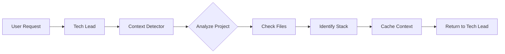

# Architecture Guide - Technical Implementation

This document contains the technical implementation details of the Awesome Claude Agents system.

## 🏗️ System Architecture

### Agent Organization

```
agents/
├── orchestrators/          # High-level coordinators
│   ├── tech-lead-orchestrator.md
│   └── context-detector.md
│
├── core/                   # Cross-cutting concerns
│   ├── code-archaeologist.md
│   ├── code-reviewer.md
│   └── performance-optimizer.md
│
├── universal/              # Framework-agnostic
│   ├── api-architect.md
│   ├── backend-developer.md
│   └── frontend-developer.md
│
└── specialized/            # Framework-specific
    └── laravel/
        ├── laravel-api-architect.md
        └── laravel-backend-expert.md
```

## 🔍 Context Detection System

### How Detection Works

The context-detector agent analyzes project structure to identify:

```yaml
Detection Indicators:
- composer.json → Laravel/PHP
- package.json → JavaScript/Node.js
- requirements.txt → Python/Django
- Gemfile → Ruby/Rails
- go.mod → Go
- Cargo.toml → Rust
```

### Detection Flow



### Context Object Structure

```json
{
  "backend": {
    "framework": "laravel",
    "version": "10.x",
    "packages": ["sanctum", "horizon"]
  },
  "frontend": {
    "framework": "react",
    "version": "18.x",
    "state": "redux"
  },
  "database": {
    "type": "mysql",
    "orm": "eloquent"
  }
}
```

## 🎯 Intelligent Routing

### Agent Selection Algorithm

```javascript
function selectAgent(task, context) {
  // API Development
  if (task.includes("api") || task.includes("endpoint")) {
    if (context.backend === "laravel") {
      return "laravel-api-architect";
    }
    return "universal/api-architect";
  }
  
  // Frontend Development
  if (task.includes("ui") || task.includes("component")) {
    if (context.frontend === "react") {
      return "react-component-architect";
    }
    return "universal/frontend-developer";
  }
}
```

### Specialist Priority Matrix

| Task Type | Laravel | Django | Rails | Unknown |
|-----------|---------|--------|-------|---------|
| API | laravel-api-architect | django-api-dev | rails-api | universal/api |
| Auth | laravel-auth | django-auth | devise | universal/auth |
| DB | eloquent-expert | django-orm | active-record | universal/db |

## 🔄 Agent Communication Protocol

### Delegation Format

```yaml
From: tech-lead-orchestrator
To: laravel-api-architect
Context:
  framework: Laravel 10.x
  database: MySQL
  existing_patterns:
    - Repository pattern
    - Service layer
Task: Build product CRUD API
Requirements:
  - RESTful endpoints
  - API Resources
  - Validation
  - Tests
```

### Response Format

```yaml
From: laravel-api-architect
To: tech-lead-orchestrator
Status: Complete
Created:
  - app/Http/Controllers/Api/ProductController.php
  - app/Http/Resources/ProductResource.php
  - app/Http/Requests/ProductRequest.php
  - routes/api.php (updated)
  - tests/Feature/ProductApiTest.php
Next: Frontend implementation needed
```

## 🧩 Agent Capabilities

### Tool Access

Each agent has access to specific tools:

```yaml
Orchestrators:
  - Task (for spawning sub-agents)
  - TodoWrite (task management)
  - Read, Grep, Bash

Specialists:
  - Read, Write, Edit, MultiEdit
  - Bash (for running commands)
  - Grep, Glob (for searching)

Core Agents:
  - Read, Grep, Glob, LS
  - Performance tools
  - Analysis utilities
```

### Context Awareness

Agents maintain context through:

1. **Session Context**: Cached project information
2. **Task Context**: Current task requirements
3. **Historical Context**: Previous agent outputs

## 🎨 Agent Design Patterns

### 1. Orchestrator Pattern

```yaml
Role: High-level coordination
Responsibilities:
  - Understand vague requirements
  - Break down into tasks
  - Select appropriate agents
  - Coordinate execution
```

### 2. Specialist Pattern

```yaml
Role: Deep domain expertise
Responsibilities:
  - Implement specific solutions
  - Follow framework conventions
  - Apply best practices
  - Produce production-ready code
```

### 3. Universal Pattern

```yaml
Role: Fallback implementation
Responsibilities:
  - Handle any technology
  - Provide generic solutions
  - Maintain quality standards
  - Enable future migration
```

## 📊 Performance Considerations

### Context Caching

- Project context is detected once per session
- Cached in orchestrator memory
- Reduces repeated file analysis

### Agent Selection Optimization

- Direct routing based on keywords
- Fallback chains for unknown scenarios
- Parallel execution where possible

### Resource Usage

- Agents share file system context
- Minimal overhead for delegation
- Efficient tool usage patterns

## 🔒 Security Considerations

### Agent Boundaries

- Agents only access project files
- No external network calls
- Respect .gitignore patterns

### Code Generation

- Follow security best practices
- No hardcoded credentials
- Proper input validation

## 🚀 Extension Points

### Adding New Specialists

1. Create agent file in `specialized/[framework]/`
2. Define expertise and examples
3. Add routing logic to orchestrator
4. Test with real scenarios

### Custom Orchestrators

1. Extend base orchestrator pattern
2. Define specialized routing
3. Add domain knowledge
4. Integrate with existing system

## 📈 Future Architecture

### Planned Enhancements

1. **Dynamic Agent Loading**: Load agents based on project needs
2. **Agent Learning**: Improve routing based on outcomes
3. **Parallel Execution**: Multiple agents working simultaneously
4. **Domain Orchestrators**: Industry-specific coordinators

### Integration Points

- **MCP Servers**: External data sources
- **CI/CD**: Automated testing and deployment
- **IDE Plugins**: Direct editor integration
- **API Access**: Programmatic agent invocation