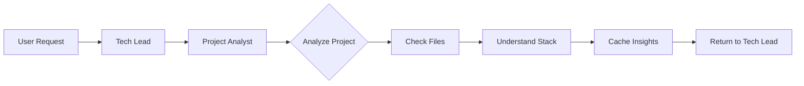

# Architecture Guide - Technical Implementation

This document contains the technical implementation details of the Awesome Claude Agents system.

## 🏗️ System Architecture

### Agent Organization

```
agents/
├── orchestrators/          # High-level coordinators
│   ├── tech-lead-orchestrator.md
│   └── project-analyst.md
│
├── core/                   # Cross-cutting concerns
│   ├── code-archaeologist.md
│   ├── code-reviewer.md
│   └── performance-optimizer.md
│
├── universal/              # Framework-agnostic
│   ├── api-architect.md
│   ├── backend-developer.md
│   └── frontend-developer.md
│
└── specialized/            # Framework-specific
    ├── laravel/
    │   ├── laravel-api-architect.md
    │   └── laravel-backend-expert.md
    ├── django/
    │   ├── django-api-developer.md
    │   └── django-backend-expert.md
    └── [other-frameworks]/
```

## 🔍 Project Analysis System

### How Analysis Works

The project-analyst agent examines project structure to detect the technology stack:

**Common Detection Indicators:**
- `composer.json` → PHP (Laravel, Symfony, etc.)
- `package.json` → JavaScript/Node.js
- `requirements.txt` or `Pipfile` → Python (Django, Flask, etc.)
- `Gemfile` → Ruby (Rails, Sinatra, etc.)
- `go.mod` → Go
- `Cargo.toml` → Rust
- `pom.xml` or `build.gradle` → Java (Spring, etc.)

### Analysis Flow



### Context Object Structure

```json
{
  "backend": {
    "framework": "laravel",
    "version": "10.x",
    "packages": ["sanctum", "horizon"]
  },
  "frontend": {
    "framework": "react",
    "version": "18.x",
    "state": "redux"
  },
  "database": {
    "type": "mysql",
    "orm": "eloquent"
  }
}
```

## 🎯 Intelligent Routing

### Agent Selection Process

The Tech Lead Orchestrator intelligently routes tasks based on the detected project context:

**For API Development:**
- If the project uses a specific backend framework (Laravel, Django, Rails, Express, etc.), the task goes to that framework's API specialist
- For unknown or custom stacks, the universal API architect handles the task

**For Frontend Development:**
- Framework-specific tasks go to specialized agents (React, Vue, Angular specialists)
- Generic or unknown frontend work goes to the universal frontend developer

**For Database Work:**
- Projects with framework-specific ORMs get specialized database experts
- General database tasks use the universal database architect

This adaptive routing ensures every task is handled by the most knowledgeable specialist available, whether framework-specific or universal.

## 🔄 Agent Communication Protocol

### Delegation Communication

When the Tech Lead delegates tasks, they provide clear context to specialists:

**To Framework Specialists:**
"I'm assigning this API task to our Django specialist. The project uses Django 4.x with PostgreSQL. Please build the product CRUD endpoints following the project's existing patterns and using Django REST Framework."

**To Universal Agents:**
"I'm assigning this to our universal API architect since no specific framework was detected. Please create RESTful endpoints using clean, maintainable patterns."

### Agent Responses

Specialists report back with clear summaries:

**From Framework Specialist:**
"I've completed the API implementation. Created the product endpoints with full CRUD operations, added validation, and included tests. The frontend team can now integrate with these endpoints."

**From Universal Agent:**
"API complete using standard RESTful patterns. I've documented the endpoints and response formats. The implementation is framework-agnostic and can be easily maintained."

## 🧩 Agent Capabilities

### Tool Access

Each agent has access to specific tools:

```yaml
Orchestrators:
  - Task (for spawning sub-agents)
  - TodoWrite (task management)
  - Read, Grep, Bash

Specialists:
  - Read, Write, Edit, MultiEdit
  - Bash (for running commands)
  - Grep, Glob (for searching)

Core Agents:
  - Read, Grep, Glob, LS
  - Performance tools
  - Analysis utilities
```

### Context Awareness

Agents maintain context through:

1. **Session Context**: Cached project information
2. **Task Context**: Current task requirements
3. **Historical Context**: Previous agent outputs

## 🎨 Agent Design Patterns

### 1. Orchestrator Pattern

```yaml
Role: High-level coordination
Responsibilities:
  - Understand vague requirements
  - Break down into tasks
  - Select appropriate agents
  - Coordinate execution
```

### 2. Specialist Pattern

```yaml
Role: Deep domain expertise
Responsibilities:
  - Implement specific solutions
  - Follow framework conventions
  - Apply best practices
  - Produce production-ready code
```

### 3. Universal Pattern

```yaml
Role: Fallback implementation
Responsibilities:
  - Handle any technology
  - Provide generic solutions
  - Maintain quality standards
  - Enable future migration
```

## 📊 Performance Considerations

### Context Caching

- Project context is detected once per session
- Cached in orchestrator memory
- Reduces repeated file analysis

### Agent Selection Optimization

- Direct routing based on keywords
- Fallback chains for unknown scenarios
- Parallel execution where possible

### Resource Usage

- Agents share file system context
- Minimal overhead for delegation
- Efficient tool usage patterns

## 🔒 Security Considerations

### Agent Boundaries

- Agents only access project files
- No external network calls
- Respect .gitignore patterns

### Code Generation

- Follow security best practices
- No hardcoded credentials
- Proper input validation

## 🚀 Extension Points

### Adding New Specialists

1. Create agent file in `specialized/[framework]/`
2. Define expertise and examples
3. Add routing logic to orchestrator
4. Test with real scenarios

### Custom Orchestrators

1. Extend base orchestrator pattern
2. Define specialized routing
3. Add domain knowledge
4. Integrate with existing system

## 📈 Future Architecture

### Planned Enhancements

1. **Dynamic Agent Loading**: Load agents based on project needs
2. **Agent Learning**: Improve routing based on outcomes
3. **Parallel Execution**: Multiple agents working simultaneously
4. **Domain Orchestrators**: Industry-specific coordinators

### Integration Points

- **MCP Servers**: External data sources
- **CI/CD**: Automated testing and deployment
- **IDE Plugins**: Direct editor integration
- **API Access**: Programmatic agent invocation