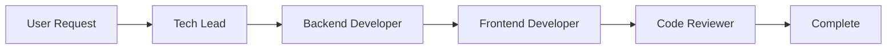

# Interconnected Agents - Advanced Workflows

Build complex, multi-agent workflows that mirror real development teams.

## Core Concept

Interconnected agents work together by:
1. **Recognizing boundaries** - Each agent knows its expertise limits
2. **Passing context** - Sharing relevant information during handoffs
3. **Orchestrating workflows** - Coordinating multi-step processes

## Implementation Patterns

### 1. Delegation in Descriptions

Use XML-style delegations to define handoff points:

```yaml
description: |
  Expert backend API developer for any technology stack.
  
  Examples:
  - <example>
    Context: User needs full-stack feature
    user: "Build a user management system"
    assistant: "I'll start with the backend API, then hand off to frontend"
    <commentary>
    Complex feature requiring backend-first approach
    </commentary>
  </example>
  
  Delegations:
  - <delegation>
    Trigger: UI/Frontend needed
    Target: frontend-developer, ui-specialist
    Handoff: "API complete: POST /api/users, GET /api/users/{id}. Frontend can now integrate."
  </delegation>
  - <delegation>
    Trigger: Security review requested
    Target: security-guardian
    Handoff: "Feature complete. Ready for security audit focusing on: auth, validation, API endpoints"
  </delegation>
```

### 2. System Prompt Delegation

Include delegation logic in the agent's system prompt:

```markdown
## Delegation Protocol

I recognize these scenarios require other specialists:

1. **Frontend Implementation**
   - Signal: "UI", "interface", "frontend", "client-side"
   - Action: Complete backend, document API, suggest frontend expert
   - Context passed: Endpoints, auth method, data structures

2. **Security Review**
   - Signal: Task completion, "review", "audit", "security"
   - Action: Summarize implementation, highlight security touchpoints
   - Context passed: Auth implementation, input validation, API exposure

3. **Database Optimization**
   - Signal: "slow queries", "optimization", "performance"
   - Action: Identify problem queries, suggest database expert
   - Context passed: Query logs, table structures, current indexes
```

### 3. Orchestrator Agents

Create meta-agents that coordinate workflows:

```yaml
---
name: tech-lead-orchestrator
description: |
  Orchestrates complex software projects by coordinating specialist agents.
  
  Examples:
  - <example>
    Context: New feature request
    user: "Add a blog system to my application"
    assistant: "I'll orchestrate this feature across multiple specialists"
    <commentary>
    Complex feature requiring coordination of backend, frontend, and review
    </commentary>
  </example>
tools: Task
---

You are a technical lead who coordinates specialist agents.

## Workflow Management

For full-stack features, I follow this pattern:

1. **Requirements Analysis**
   - Break down the feature into components
   - Identify which specialists are needed

2. **Backend Development**
   - Delegate to: backend-developer
   - Context: Data models, API requirements
   - Wait for: API documentation

3. **Frontend Development**
   - Delegate to: frontend-developer
   - Context: API endpoints, user stories
   - Wait for: UI implementation

4. **Integration Testing**
   - Delegate to: test-engineer
   - Context: Feature requirements, edge cases
   - Wait for: Test coverage report

5. **Security Review**
   - Delegate to: security-guardian
   - Context: Complete implementation
   - Wait for: Security approval
```

## Handoff Patterns

### 1. Sequential Handoff



Example workflow:
1. Tech Lead analyzes requirements
2. Backend Developer implements API
3. Frontend Developer builds UI
4. Code Reviewer validates everything

### 2. Parallel Execution

```yaml
Parallel Tasks:
- backend-developer: Create API endpoints
- database-optimizer: Design schema
- frontend-developer: Build UI mockups
```

### 3. Conditional Routing

```markdown
If performance issues detected:
  → performance-optimizer
Else if security concerns:
  → security-guardian
Else:
  → Continue normal flow
```

## Context Passing Examples

### Rich Context Object

```json
{
  "task": "User authentication system",
  "completed_by": "backend-developer",
  "next_agent": "frontend-developer",
  "context": {
    "endpoints": {
      "login": "POST /api/auth/login",
      "register": "POST /api/auth/register",
      "refresh": "POST /api/auth/refresh"
    },
    "auth_method": "JWT",
    "token_location": "Authorization header",
    "validation_rules": {
      "email": "required|email",
      "password": "required|min:8"
    }
  },
  "notes": "Using refresh tokens for security"
}
```

### Minimal Handoff

```yaml
From: code-archaeologist
To: refactoring-expert
Message: "Legacy code mapped. 15 services need modernization. Start with auth service."
```

## Orchestration Strategies

### 1. Feature-Driven Orchestration

For new features:
```
Requirements → Design → Implementation → Testing → Review → Deploy
```

### 2. Problem-Driven Orchestration

For debugging:
```
Reproduce → Investigate → Fix → Verify → Document
```

### 3. Optimization-Driven Orchestration

For performance:
```
Profile → Identify → Optimize → Measure → Monitor
```

## Best Practices

### 1. Clear Boundaries

Each agent should know:
- What they do
- What they don't do
- Who to hand off to

### 2. Information Preservation

Pass forward:
- Decisions made
- Context discovered
- Potential issues

### 3. Avoid Circular Dependencies

```
❌ A → B → C → A (circular)
✅ A → B → C → Done (linear)
✅ A → [B,C] → D (parallel merge)
```

## Example: Full-Stack Feature

**User**: "Build a real-time notification system"

**Orchestration**:

1. **Tech Lead** breaks down:
   - Backend: WebSocket server
   - Frontend: Notification UI
   - Database: Message storage
   - Infrastructure: Redis pub/sub

2. **Parallel execution**:
   - backend-developer: WebSocket implementation
   - database-optimizer: Schema design
   - frontend-developer: UI components

3. **Integration**:
   - Full-stack coordination
   - End-to-end testing

4. **Review**:
   - Code review
   - Security audit
   - Performance check

## Advanced Patterns

### 1. Specialist Pools

```yaml
Frontend Pool:
  - react-specialist
  - vue-expert
  - angular-developer
  
Backend Pool:
  - node-expert
  - python-developer
  - go-specialist
```

### 2. Dynamic Selection

```markdown
Based on project stack:
- If React → react-specialist
- If Vue → vue-expert
- If Vanilla → frontend-developer
```

### 3. Feedback Loops

```
Initial Implementation → Review → Fixes → Re-review → Approved
```

## Common Pitfalls

### 1. Over-Orchestration
Don't coordinate simple tasks that one agent can handle.

### 2. Context Loss
Always pass sufficient context forward.

### 3. Unclear Handoffs
Be explicit about what's done and what's next.

## Summary

Interconnected agents enable:
- **Complex workflows** - Mirror real team dynamics
- **Parallel execution** - Multiple agents working simultaneously  
- **Context preservation** - Information flows seamlessly
- **Quality gates** - Reviews and checks at each stage

Build agents that collaborate like your best development team!