# Interconnected Agents - Advanced Workflows

Build complex, multi-agent workflows that mirror real development teams.

## Core Concept

Interconnected agents work together by:
1. **Recognizing boundaries** - Each agent knows its expertise limits
2. **Passing context** - Sharing relevant information during handoffs
3. **Orchestrating workflows** - Coordinating multi-step processes

## Implementation Patterns

### 1. Delegation in Descriptions

Use XML-style delegations to define handoff points:

```yaml
description: |
  Laravel backend API developer.
  
  Examples:
  - <example>
    Context: User needs full-stack feature
    user: "Build a user management system"
    assistant: "I'll start with the Laravel backend, then hand off to frontend"
    <commentary>
    Complex feature requiring backend-first approach
    </commentary>
  </example>
  
  Delegations:
  - <delegation>
    Trigger: UI/Frontend needed
    Target: tailwind-frontend-expert, react-specialist
    Handoff: "API complete: POST /api/users, GET /api/users/{id}. Frontend can now integrate."
  </delegation>
  - <delegation>
    Trigger: Security review requested
    Target: laravel-code-auditor
    Handoff: "Feature complete. Ready for security audit focusing on: auth, validation, API endpoints"
  </delegation>
```

### 2. System Prompt Delegation

Include delegation logic in the agent's system prompt:

```markdown
## Delegation Protocol

I recognize these scenarios require other specialists:

1. **Frontend Implementation**
   - Signal: "UI", "interface", "frontend", "React", "Vue"
   - Action: Complete backend, document API, suggest frontend expert
   - Context passed: Endpoints, auth method, data structures

2. **Security Review**
   - Signal: Task completion, "review", "audit", "security"
   - Action: Summarize implementation, highlight security touchpoints
   - Context passed: Auth implementation, input validation, API exposure

3. **Database Optimization**
   - Signal: "slow queries", "optimization", "performance"
   - Action: Identify problem queries, suggest database expert
   - Context passed: Query logs, table structures, current indexes
```

### 3. Orchestrator Agents

Create meta-agents that coordinate workflows:

```yaml
---
name: laravel-project-orchestrator
description: |
  Orchestrates full-stack Laravel projects by coordinating specialist agents.
  
  Examples:
  - <example>
    Context: New feature request
    user: "Add a blog system to my Laravel app"
    assistant: "I'll orchestrate this feature across multiple specialists"
    <commentary>
    Complex feature requiring coordination of backend, frontend, and review
    </commentary>
  </example>
tools: Task
---

You are a Laravel project orchestrator who coordinates specialist agents.

## Workflow Management

For full-stack features, I follow this pattern:

1. **Requirements Analysis**
   - Break down the feature into components
   - Identify which specialists are needed
   - Create execution plan

2. **Backend Development**
   - Delegate to: laravel-backend-expert
   - Tasks: Models, migrations, controllers, API endpoints
   - Output: Documented API ready for frontend

3. **Frontend Development** 
   - Delegate to: tailwind-frontend-expert or framework specialist
   - Tasks: UI components, API integration, state management
   - Input: API documentation from backend phase

4. **Integration Testing**
   - Coordinate backend and frontend for full flow testing
   - Identify integration issues

5. **Security Review**
   - Delegate to: laravel-code-auditor
   - Tasks: Security audit, best practices review
   - Input: Complete feature code

6. **Deployment Preparation**
   - Delegate to: deployment-specialist
   - Tasks: Environment setup, optimization
```

## Real-World Workflows

### E-commerce Feature Flow

```mermaid
graph LR
    A[User Request] --> B[Project Orchestrator]
    B --> C[Laravel Backend Expert]
    C --> D[Database Architect]
    D --> E[API Documentation]
    E --> F[React Frontend Expert]
    F --> G[Payment Integration Expert]
    G --> H[Security Auditor]
    H --> I[Deployment Specialist]
```



### API Development Flow

```
1. API Architect: Design RESTful structure
2. Laravel Expert: Implement endpoints
3. Database Expert: Optimize queries
4. API Tester: Validate responses
5. Documentation Expert: Generate API docs
```

## Context Passing

### Structured Handoffs

Agents pass structured context:

```json
{
  "completed_by": "laravel-backend-expert",
  "next_agent": "react-frontend-expert",
  "context": {
    "api_endpoints": [
      "GET /api/products",
      "POST /api/products",
      "PUT /api/products/{id}"
    ],
    "authentication": "Bearer token",
    "cors_enabled": true,
    "sample_response": { ... }
  },
  "notes": "Pagination implemented, 20 items per page"
}
```

### Context Preservation

Each agent adds to the context:

```markdown
## Handoff Protocol

When completing my portion:
1. Summarize what was implemented
2. Document key decisions made
3. List integration points
4. Highlight potential issues
5. Suggest next steps
```

## Advanced Patterns

### Parallel Execution

Some tasks can run in parallel:

```yaml
Workflows:
- <workflow name="feature-development">
  Parallel:
    - laravel-backend-expert: API development
    - database-architect: Schema design
  Sequential:
    - frontend-expert: After API complete
    - security-auditor: After all development
</workflow>
```

### Conditional Delegation

Agents make smart decisions:

```markdown
If (user mentions "React"):
  Delegate to react-specialist
Elif (user mentions "Vue"):
  Delegate to vue-expert
Else:
  Delegate to tailwind-frontend-expert
```

### Feedback Loops

Agents can return to previous specialists:

```
Frontend Expert → "API missing user avatar field" → Backend Expert → Update API → Frontend Expert
```

## Creating Your Own Workflows

1. **Map the Process**: Identify all steps in your workflow
2. **Assign Specialists**: Match each step to an agent
3. **Define Handoffs**: Specify what context passes between agents
4. **Handle Edge Cases**: Plan for errors and revisions
5. **Test End-to-End**: Ensure smooth execution

## Benefits

- **Mirrors Real Teams**: Works like actual development teams
- **Expertise Isolation**: Each agent masters one domain
- **Scalable Complexity**: Handle projects of any size
- **Context Aware**: Information flows naturally
- **Quality Gates**: Built-in review stages

## Example: Full-Stack Feature

User: "Build a product catalog with admin panel"

```
1. Project Orchestrator analyzes requirements
2. Laravel Expert creates:
   - Product model and migration
   - CRUD API endpoints
   - Admin middleware
3. Database Architect optimizes:
   - Indexes for search
   - Query performance
4. React Expert builds:
   - Product listing component
   - Admin dashboard
   - API integration
5. Security Auditor reviews:
   - Authentication flow
   - Authorization rules
   - Input validation
6. Deployment Expert handles:
   - Production setup
   - Performance optimization
```

Each agent completes their portion and passes rich context to the next, creating a seamless development experience.