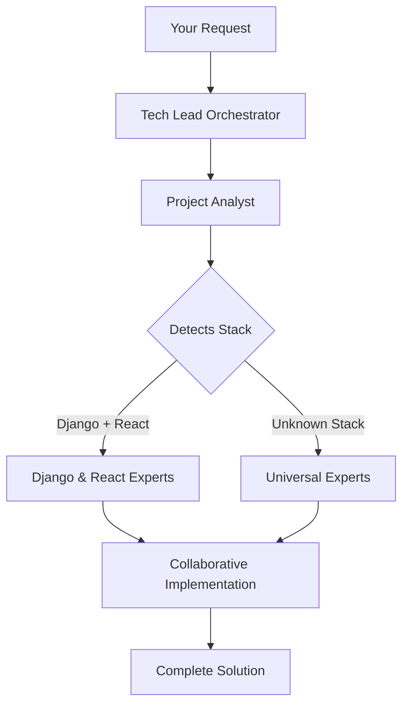

# Quick Start - AI Development Team

Get your specialized AI development team up and running in 2 minutes!

## 🚀 Installation

```bash
# Clone the repository
git clone https://github.com/vijaythecoder/awesome-claude-agents.git

# Copy agents to Claude directory
cp -r awesome-claude-agents/agents ~/.claude/

# Verify installation
ls ~/.claude/agents/
# Should show: orchestrators/ core/ universal/ specialized/
```

## 🎯 Configure Your Team

Let the project optimizer analyze your project and assemble the perfect team:

```bash
claude "Use project-optimizer to optimize my project"
```

### What This Does:
1. **Analyzes** your project structure and dependencies
2. **Detects** your technology stack (frameworks, languages, tools)
3. **Selects** the best specialists for your project
4. **Configures** intelligent routing rules
5. **Saves** your team configuration to CLAUDE.md

### Example Output:
```markdown
# Your AI Development Team

Tech Stack: Django 4.2, React 18, PostgreSQL
  
Agent Assignments:
- API tasks → @django-api-developer
- Backend logic → @django-backend-expert
- Frontend → @react-component-architect
- Database → @django-orm-expert
- Performance → @performance-optimizer

Your specialized team is ready!
```

## 🎭 How Your Team Works



## 💡 Common Workflows

### Building Features
```bash
claude "Build a user authentication system"

# Your team springs into action:
# - Tech Lead creates the plan
# - Backend expert implements auth logic
# - API architect designs endpoints
# - Frontend dev builds UI components
# - All following your project's patterns!
```

### Understanding Code
```bash
claude "What does this codebase do?"

# Code Archaeologist analyzes:
# - Project structure
# - Dependencies and patterns
# - Business logic
# - Provides comprehensive overview
```

### Fixing Issues
```bash
claude "The app is running slowly"

# Performance Optimizer investigates:
# - Profiles your specific stack
# - Identifies bottlenecks
# - Implements targeted fixes
# - Measures improvements
```

### Code Review
```bash
claude "Review my recent changes"

# Code Reviewer checks:
# - Framework best practices
# - Security concerns
# - Performance impact
# - Code quality
```

## 🎯 Key Commands

### Direct Agent Requests
```bash
# Let the team decide
claude "Build a blog system"

# Or request specific expertise
claude "Use the django-backend-expert to implement caching"
```

### Check Your Team
```bash
# See your configured specialists
claude "Show my AI development team"

# List all available agents
ls ~/.claude/agents/
```

## 💡 Pro Tips

1. **Trust Your Team** - They know your project's patterns
2. **Be Specific** - "Build a blog with comments" gets better results than "Build a blog"
3. **Let Them Collaborate** - Agents hand off work naturally
4. **Learn from Output** - See best practices in action

## 🔥 Advanced Usage

### Complex Projects
Your team handles multi-step workflows automatically:
```
Tech Lead → Backend Expert → API Architect → Frontend Dev → Code Reviewer
```

### Framework Changes
Switching frameworks? Just re-run the configuration:
```bash
# After adding React to a Django project
claude "Reconfigure my AI team based on current project"
```

### Custom Workflows
Create your own agent combinations:
```bash
claude "Use performance-optimizer and database expert to optimize queries"
```

## 🐛 Troubleshooting

### Team Not Configured?
```bash
# Run the configuration command
claude "Use project-optimizer to optimize my project"
```

### Wrong Agent Activated?
```bash
# Check your configuration
cat CLAUDE.md

# Or override manually
claude "Use the react specialist for this component"
```

### Need Different Expertise?
```bash
# Agents adapt to any stack
# Universal agents provide fallback expertise
```

## 🚀 Next Steps

1. **Configure Your Team** - Run the auto-configuration
2. **Start Building** - Your team adapts to your project
3. **Explore Specialists** - Each has unique expertise
4. **Create Amazing Software** - With AI teammates!

---

Ready to experience team-based AI development? Your specialists are waiting!