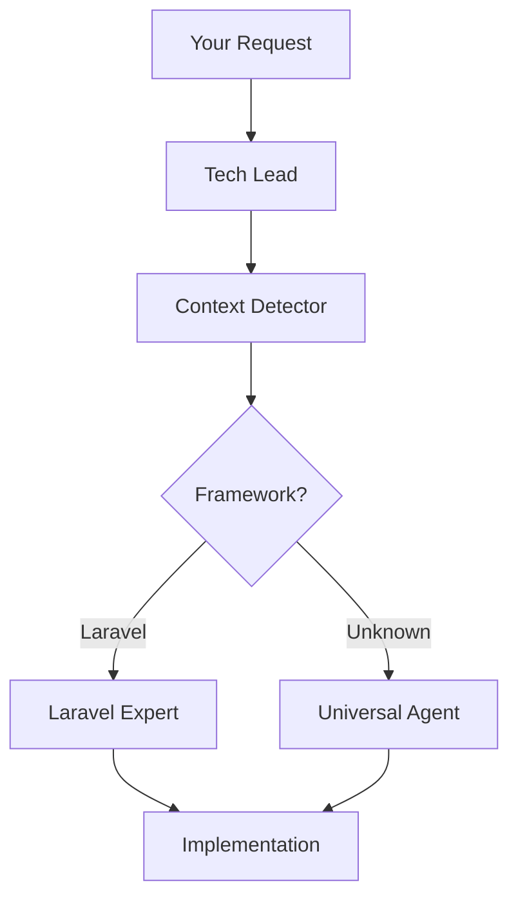

# Quick Start Guide - Context-Aware AI Agents

## 🚀 Installation (2 minutes)

```bash
# Clone the repository
git clone https://github.com/bootstrapguru/awesome-claude-agents.git

# Copy agents to Claude Code directory
cp -r awesome-claude-agents/agents/* ~/.claude/agents/

# Verify installation
claude /agents
```

## 🧠 How Context Detection Works

The system **automatically detects** your project type:

```yaml
Laravel: composer.json + "laravel/framework"
Django: requirements.txt + "django"
React: package.json + "react"
Rails: Gemfile + "rails"
```

No configuration needed - just start working!

## 🎯 Your First Experience

### Example 1: In a Laravel Project

```bash
> cd my-laravel-app
> Build a product API

# System automatically:
1. Detects Laravel via composer.json
2. Activates laravel-api-architect
3. Implements Laravel-specific patterns
4. Uses Eloquent, Resources, Sanctum
```

### Example 2: In Any Project

```bash
> cd my-new-project
> Build a product API

# System automatically:
1. No framework detected
2. Activates universal/api-architect
3. Implements framework-agnostic API
4. Uses best practices for any stack
```

### Example 3: Understanding Code

```bash
> What does this codebase do?

# Code Archaeologist activates
# Analyzes structure, dependencies, patterns
# Provides comprehensive overview
```

## 🔥 Real-World Scenarios

### Building Features

```bash
# Laravel Project
> Add user authentication

Result: Implements Laravel Sanctum with:
- Migration files
- Auth controllers
- API routes
- Middleware setup

# Unknown Project
> Add user authentication

Result: Implements JWT auth with:
- Generic user model
- Auth endpoints
- Token management
- Middleware pattern
```

### Fixing Problems

```bash
> The app is running slowly

# Performance Optimizer activates
# Detects your stack
# Applies appropriate optimizations:
- Laravel: Eager loading, query optimization
- React: Component memoization, lazy loading
- Database: Indexing, query analysis
```

### Code Review

```bash
> Review my recent changes

# Code Reviewer activates
# Understands your framework
# Checks for:
- Framework best practices
- Security issues
- Performance concerns
- Code quality
```

## 💡 Key Commands

### List Available Agents
```bash
claude /agents
```

### Force Specific Agent
```bash
> Use the laravel-api-architect to design endpoints
```

### Get Help
```bash
claude /help
```

## 🎭 Agent Types Explained

### 1. Orchestrators
- **Tech Lead** - Coordinates complex tasks
- **Project Analyst** - Understands your codebase

### 2. Core Agents (Always Available)
- **Code Archaeologist** - Explores codebases
- **Code Reviewer** - Quality assurance
- **Performance Optimizer** - Speed improvements

### 3. Universal Agents (Fallbacks)
- **API Architect** - Generic API design
- **Backend Developer** - Any language
- **Frontend Developer** - Any framework

### 4. Specialized Agents (When Detected)
- **Laravel Experts** - Deep Laravel knowledge
- **React Specialists** - React best practices
- **Django Masters** - Django patterns

## 🔗 How Agents Collaborate



## 🚀 Advanced Tips

### 1. Trust the Detection
```bash
# Just say what you want
> Build a blog system

# System figures out the rest
```

### 2. Provide Context When Needed
```bash
# More specific = better results
> Build a blog with comments and categories
```

### 3. Let Agents Delegate
```bash
# They know when to hand off
Tech Lead → Backend Expert → Frontend Expert → Done
```

## 📊 What to Expect

### In Framework Projects
- Framework-specific implementations
- Best practices automatically applied
- Optimal performance patterns
- Native feature usage

### In Generic Projects
- Clean, maintainable code
- Industry best practices
- Framework-agnostic patterns
- Easy to migrate later

## 🐛 Troubleshooting

### Agents Not Found
```bash
ls ~/.claude/agents/
# Should show: orchestrators/ core/ universal/ specialized/
```

### Wrong Agent Activated
```bash
# Check detection
> Show me the detected project context

# Or force specific agent
> Use the laravel-backend-expert for this task
```

### Need Different Framework
```bash
# Agents adapt to what they find
# Just start coding in your preferred stack
```

## 🎯 Pro Tips

1. **Start Simple** - Let detection work its magic
2. **Build Incrementally** - Agents maintain context
3. **Trust Expertise** - They know the patterns
4. **Learn from Output** - See best practices in action

## 🚀 Next Steps

1. **Try Different Tasks**
   - Building features
   - Fixing bugs
   - Optimizing performance
   - Understanding code

2. **Explore Specialists**
   - Each has unique expertise
   - They collaborate seamlessly

3. **Create Projects**
   - Any technology stack
   - Agents adapt automatically

Ready to experience context-aware development? Just start building!