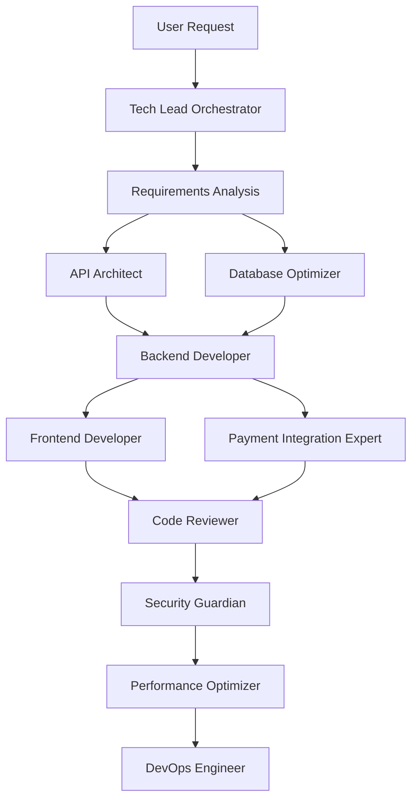

# Agent Workflow Examples

Real-world examples of how agents collaborate to solve complex problems across different technologies.

## 🏗️ Building a Full-Stack Application

### Scenario: E-commerce Platform
**User Request**: "Build an online marketplace with user accounts, product listings, and payments"



**Execution Flow**:

1. **Tech Lead Orchestrator** breaks down requirements:
   - User authentication system
   - Product catalog with search
   - Shopping cart and checkout
   - Payment processing
   - Admin dashboard

2. **API Architect** designs RESTful endpoints:
   ```
   POST   /api/auth/register
   POST   /api/auth/login
   GET    /api/products
   POST   /api/cart/items
   POST   /api/orders
   ```

3. **Database Optimizer** designs schema:
   - Users table with indexes
   - Products with full-text search
   - Orders with relationships
   - Optimized for read-heavy operations

4. **Backend Developer** implements:
   - Node.js/Express or Python/Django or Java/Spring
   - JWT authentication
   - Stripe payment integration
   - Redis caching layer

5. **Frontend Developer** creates:
   - React/Vue/Angular SPA
   - Responsive design
   - Real-time cart updates
   - Progressive enhancement

6. **Security Guardian** audits:
   - SQL injection prevention
   - XSS protection
   - Payment security compliance
   - Rate limiting

## 🔥 Emergency Performance Fix

### Scenario: Production Crisis
**User Request**: "Our app is down! Response times over 30 seconds!"

```
Performance Optimizer (Lead)
├─→ Code Archaeologist: "Map current architecture"
├─→ Database Optimizer: "Analyze slow queries"
├─→ DevOps Engineer: "Check infrastructure"
└─→ Monitoring Specialist: "Set up diagnostics"
```

**Real-Time Collaboration**:

```yaml
# Performance Optimizer identifies:
- Database queries taking 25+ seconds
- Memory leak in background jobs
- Unoptimized images loading

# Immediate actions:
1. Database Optimizer:
   - Adds missing indexes
   - Optimizes N+1 queries
   - Implements query caching

2. Backend Developer:
   - Fixes memory leak
   - Implements pagination
   - Adds response caching

3. DevOps Engineer:
   - Scales servers horizontally
   - Configures CDN
   - Optimizes nginx settings

Result: Response time < 200ms
```

## 🔄 Legacy System Modernization

### Scenario: 10-Year-Old Monolith
**User Request**: "Modernize our PHP 5.6 monolith to microservices"

**Phase 1: Analysis**
```
Code Archaeologist leads:
- Maps 500k lines of code
- Identifies 12 bounded contexts
- Documents business logic
- Finds 200+ SQL queries
```

**Phase 2: Planning**
```
Tech Lead Orchestrator creates migration plan:
1. Strangle Fig pattern
2. API gateway introduction
3. Incremental service extraction
4. Database decomposition
```

**Phase 3: Execution**
```
Week 1-2: Authentication Service
├─→ API Architect: Design auth API
├─→ Backend Developer: Implement in Go
├─→ Test Engineer: 100% coverage
└─→ DevOps: Containerize

Week 3-4: Product Catalog Service
├─→ Database Optimizer: Extract product data
├─→ Backend Developer: Node.js microservice
├─→ Performance Optimizer: Elasticsearch integration
└─→ API Architect: GraphQL layer
```

## 🚀 Startup MVP Development

### Scenario: AI-Powered Task Manager
**User Request**: "Build MVP in 2 weeks: AI suggests task priorities"

**Rapid Development Flow**:

```
Day 1-2: Architecture & Setup
- Tech Lead: Define MVP scope
- API Architect: Design simple API
- DevOps: Set up CI/CD

Day 3-5: Backend Development
- Backend Dev: FastAPI + PostgreSQL
- AI Specialist: OpenAI integration
- Database Optimizer: Simple schema

Day 6-8: Frontend Development
- Frontend Dev: React + Tailwind
- UX Designer: Minimal viable UI
- Mobile Dev: Responsive design

Day 9-10: Integration
- Full Stack Dev: Connect all parts
- Test Engineer: Critical path testing
- Performance: Basic optimization

Day 11-12: Polish & Deploy
- Code Reviewer: Quality check
- Security: Basic audit
- DevOps: Deploy to Vercel/Heroku
```

## 🔍 Codebase Understanding

### Scenario: New Developer Onboarding
**User Request**: "Just joined team, need to understand this React/Django codebase"

```
Code Archaeologist Process:

1. Structure Analysis:
   /frontend (React + TypeScript)
   ├── components/
   ├── hooks/
   ├── services/
   └── store/
   
   /backend (Django + DRF)
   ├── apps/
   ├── api/
   ├── core/
   └── utils/

2. Key Findings:
   - Redux for state management
   - Custom authentication system
   - WebSocket for real-time
   - Celery for background jobs

3. Documentation Generated:
   - Architecture diagram
   - API endpoint map
   - Data flow chart
   - Setup guide
```

## 🛡️ Security Audit

### Scenario: Pre-launch Security Review
**User Request**: "We launch next week, need security audit"

**Security Workflow**:

```
Security Guardian coordinates:

1. Code Reviewer:
   - Static analysis
   - Dependency vulnerabilities
   - Code injection risks

2. API Architect:
   - Authentication review
   - Authorization check
   - Rate limiting verify

3. Database Optimizer:
   - SQL injection prevention
   - Data encryption audit
   - Backup strategy

4. DevOps Engineer:
   - Infrastructure security
   - SSL/TLS configuration
   - Firewall rules

Output: Security report with:
- 3 Critical (fixed immediately)
- 7 High (fixed before launch)
- 12 Medium (roadmap items)
```

## 💡 Common Patterns

### Pattern 1: Feature Development
```
Tech Lead → Requirements
├─→ Backend: API implementation
├─→ Frontend: UI development
└─→ Together: Integration
    └─→ Code Review → Testing → Deploy
```

### Pattern 2: Bug Investigation
```
Debugger Detective → Reproduce issue
├─→ Code Archaeologist: Find root cause
├─→ Relevant Expert: Implement fix
└─→ Test Engineer: Prevent regression
```

### Pattern 3: Performance Optimization
```
Performance Optimizer → Profile application
├─→ Database Optimizer: Query tuning
├─→ Frontend Expert: Bundle optimization
├─→ Backend Expert: Algorithm improvement
└─→ DevOps: Infrastructure scaling
```

## 🎯 Technology-Specific Examples

### React + Node.js Project
```
User: "Add real-time notifications"

Flow:
1. Tech Lead: WebSocket vs SSE decision
2. Backend Dev: Socket.io implementation
3. Frontend Dev: React hooks for real-time
4. DevOps: Redis pub/sub setup
5. Test Engineer: Integration tests
```

### Python Data Pipeline
```
User: "Process 1TB of logs daily"

Flow:
1. Data Engineer: Apache Spark setup
2. Python Expert: PySpark pipelines
3. Database Optimizer: Partitioning strategy
4. DevOps: Kubernetes cluster
5. Monitoring: Datadog integration
```

### Mobile App Development
```
User: "Native iOS and Android apps"

Flow:
1. Tech Lead: React Native decision
2. Mobile Expert: Shared codebase
3. API Architect: Mobile-first API
4. Performance: Bundle optimization
5. Test Engineer: Device testing
```

## 🔄 Continuous Improvement

Agents learn from each project:
- Better handoff patterns
- Improved context passing
- Refined expertise
- Faster execution

Each workflow makes the next one better!